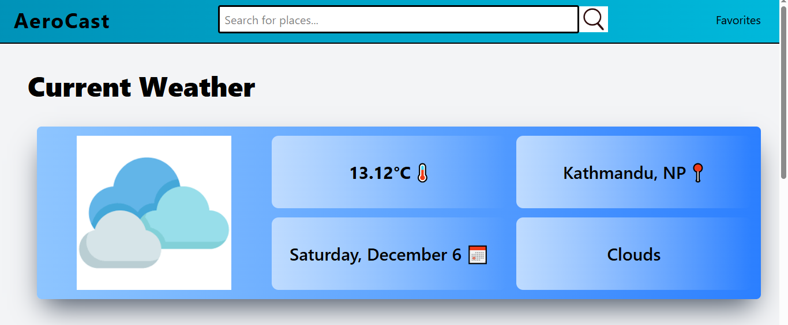
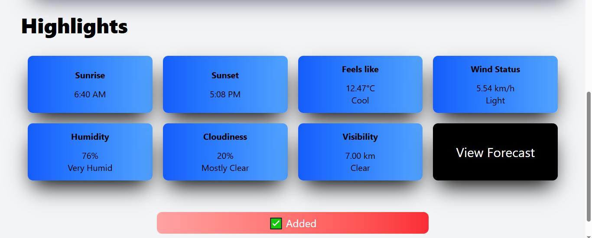
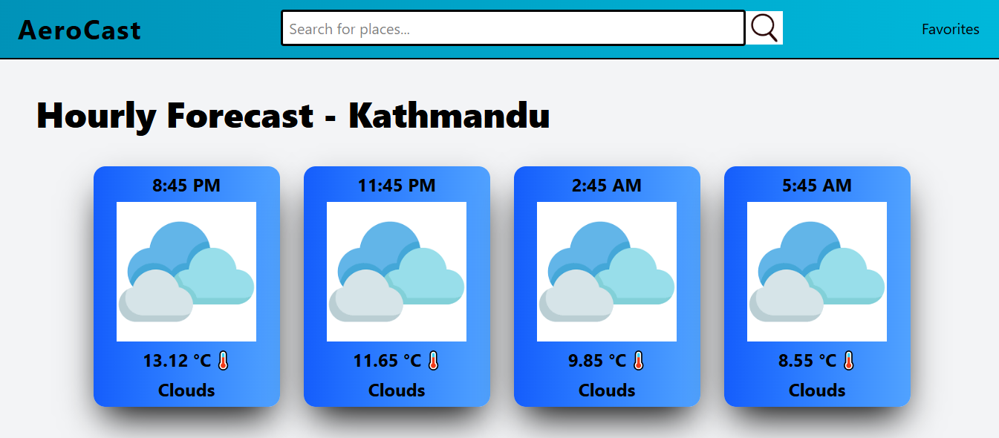
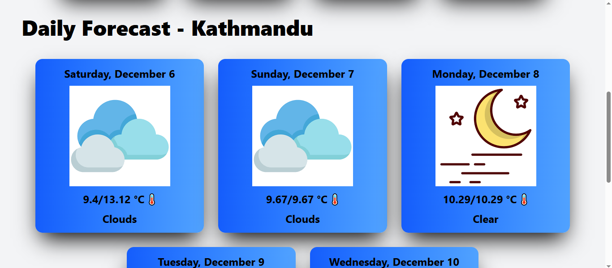
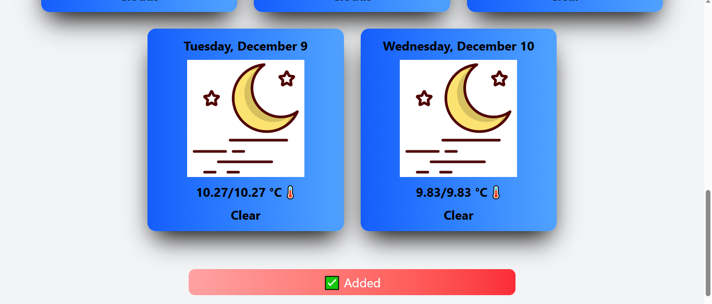
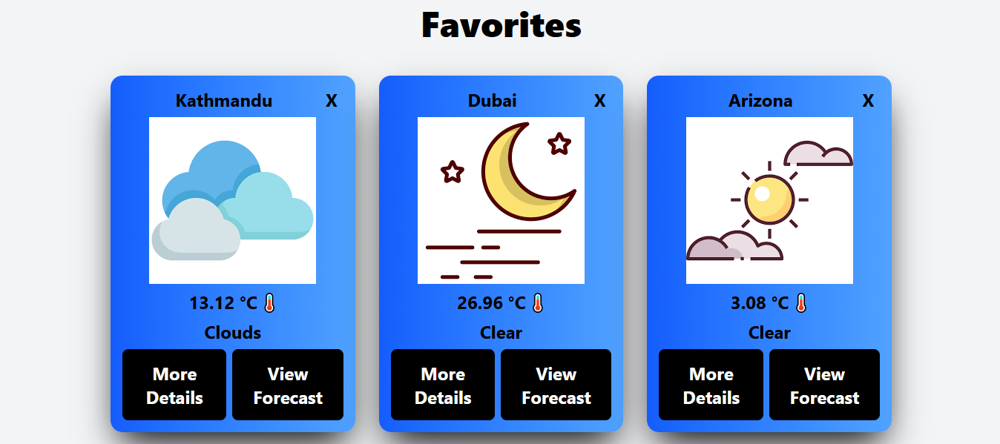

# Weather Site Using React JS - [Live Link](https://)
This site is a collection of 3 web pages all demonstrating different things of weather. It also demonstrates my good control over React JS.

## Preview
1. **Home Page**

2. **Forecast Page**

3. **Favorite**

## Features
- You can search any valid location or the one that is available from OpenWeather Free API.
- You can know about the current weather along with some detailed highlights on Wind Speed, Humidity and many more.
- You can also view forecast of upto 12 hours with 3 hours different and also upto next 5 days.
- Daily forecast will show the minimum/maximum temperature of the day along with main weather type.
- You can also save location of your choice and easily access it through Favorite page.
- No fear of losing data as it will be saved on your local browser storage.
- Smart error handling incase if there is invalid location or no location.

## Usage
If you want to see the website working then no need to install my code on your local computer just click at the live link above and start using it.

## Technologies Used
1. HTML
2. Tailwind CSS
3. JavaScript
4. React JS
5. React Router
6. Axios
7. Dayjs

## Future Improvements
I will add backend to store user data about their favorite locations so that they can easily access on any device of their choice.

## Author
Name: Amrit Paudel